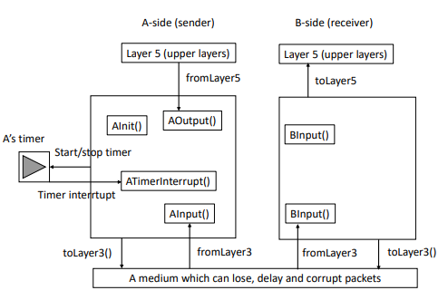

# Reliable-Transport-Protocol

This program simulates the routine of a TCP-like reliable transport protocol.

This program is provided for educational purpose. Please do not clone this program for your submission and do not use this resource for commercial purpose, because **there are still many bugs to be fixed and we modify some code in the NetworkSimulator.java**. Besides, if you use this program, your professor and TA will find out.

## File structure
- default packet
    - Project.java
- event
    - Event.java
    - EventList.java
    - EventListImpl.java
- packet
    - Message.java
    - Packet.java
- simulator
    - GoBackNSimulator.java
    - NetworkSimulator.java
    - SelectiveRepeatSimulator.java
- util
    - GoBackNReceiverQueue.java
    - GoBackNSenderQueue.java
    - OSIRandom.java
    - SelectiveRepeatReceiveQueue.java
    - SelectiveRepeatSenderQueue.java
    - SlidingWindowQueue.java

Project.java is the entrance of this program. 

## How to run this program?
1. Find Project.java.
2. Find simulator at the end of this file.
3. Run Selective Repeat Simulator or Go Back N simulator.

## The Communication model



## The routine of this program
1. This program does not use multithreading or multiprocessing. For simplicity, TA adopts an event list (like a queue) to simulate what happen in this communication model. Please refer to packet event.
2. How do we simulate the time in the event list? TA adopts a smart and simple strategy: suppose the start time of this program is 0 and the happening time of the next event will be 0 + a random number. Different actions will generate different events and the simulator will push these events into the event list. Every time we simulate an event happens, we pop the next event which has the smallest time number up and execute this event.
3. Message and Packet.
```C
struct msg {
    char data[20];
}

struct packet {
    int seqnum;
    int acknum;
    int checksum;
    char payload[20];
}
```

## Selective Repeat with cumulative ACK

### Finite State Machine

#### Sender behaviors
1.	Event: data received from above.
    
    Action:
    1. Buffer it.
    2. Check the next available sequence number for the packet. If the sequence number is within the sender’s window, the data is packetized and sent.
    3. Start timer.

2.	Event: timeout or duplicate ACK.

    Action: 
    1. Retransmit only the next missing (unACK’ed) packet.
    2. Restart timer.

3.	Event: ACK received.

    Action: slide window and transmit the packets that now fall within the window. If the packet corrupts, discard it.

#### Receiver behaviors:
1.	Packet with sequence number in [rcv_base, rcv_base+N-1] is correctly received. 
    
    1. If the received packet falls within the receiver’s window, it is buffered.
    2. If this packet has a sequence number equal to the base of the receive window, then this packet, and any previously buffered and consecutively numbered packets are delivered to the upper layer.The receive window is then moved forward by the number of packets delivered to the upper layer.

2.	Packet with sequence number in [rcv_base – N, rcv_base – 1] is correctly received. An ACK must be generated, even though this is a packet that the receiver has previously acknowledged.
3.	Otherwise. Ignore the packet.


## Go Back N with SACK
### Finite State Machine

#### Sender behaviors:
1.	Event: Call from layer 5. 

    Action: 
    1.	Check the next available sequence number for the packet. 
    2. Make a packet and add it into the queue of sender. 
    3. If the window is not full, send the next packet in the queue of sender to layer 3. 
    4. Start timer.
2.	Event: Timeout.
    
    Action: 
    1. Retransmit all unACK’ed packets in the queue of sender.
    2. Restart timer.Event: ACK received.

3.	Event: Received an ACK packet.

    Action:
    1. For a corrupted packet, do nothing.
    2. For an uncorrupted packet and the sequence number of ACK is in the queue of sender, which indicates an effective ACK,
        1. Stop the timer.
        2. Slide the window according to the sequence number of ACK
        3. Send other packets in the queue of sender until the window becomes full.
        4. If it is a SACK packet, handle it and send packets in the queue of sender.
    3. For an uncorrupted packet but the sequence number of ACK is not in the queue of sender, which indicates a duplicate ACK, do nothing
    4. If there are unACK’ed packets in the queue of sender, restart the timer

#### Receiver behaviors:
1.	For a corrupted packet, do nothing.
2.	For an in-order packet, response an ACK with its sequence number. If there are buffered packets in the queue of receiver, try to send sequential packets to layer5.
3.	For an out of order packet, buffered in the queue of receiver. If the receiver queue is full, send an SACK packet to the sender and tell the sender which packets the receiver has.

